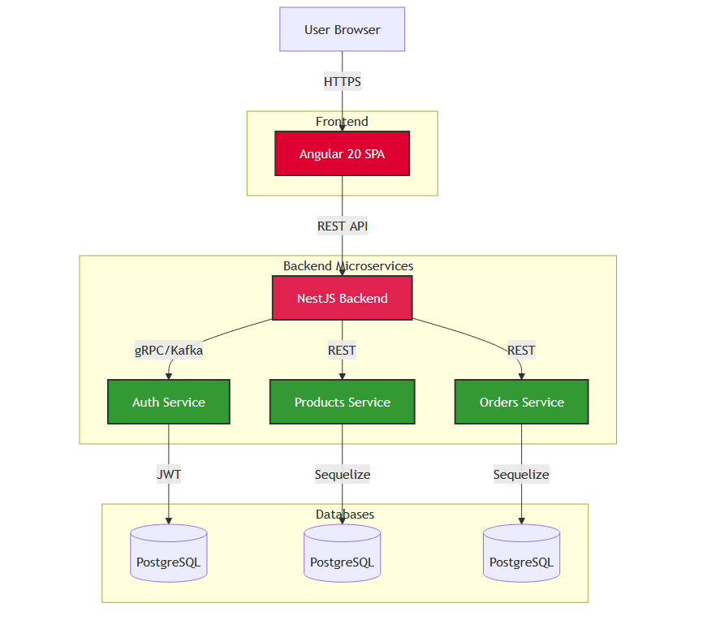

# 🛒 Internet Magazin Frontend

<p align="left">
  <!-- Project Status -->
  <a href="https://github.com/bizyukov/internet-magazin-front/actions">
    
    <!--  -->
  </a>
  <a href="https://github.com">
    
  </a>
  <a href="CONTRIBUTING.md">
    
  </a>
  <br>
  <!-- Code Quality -->
  <a href="https://codecov.io/gh/bizyukov/internet-magazin-front">
    
  </a>
  <a href="https://sonarcloud.io/project/overview?id=bizyukov_internet-magazin-front">
    
  </a>
  <br>
  <!-- Tech Stack -->
  <a href="https://angular.io/">
    
  </a>
  <a href="https://angular.dev/guide/standalone-components">
    
  </a>
  <a href="https://typescriptlang.org">
    
  </a>
</p>

> **Modern e‑commerce frontend** built with Angular 20 (Standalone, Signals) – cart, wishlist, multi‑step checkout, user dashboard, and full Swagger‑backed API integration.

## 🎯 Business value

- **Reduces time to market** for online stores by 50% (pre‑built cart, checkout, auth)
- **Improves conversion** with smooth multi‑step checkout and real‑time stock validation
- **Production‑ready** – used as a foundation for commercial projects (e.g., Federal Insurance Company internal store)
- **Fully documented** – Swagger UI integrated, Postman collection included

## 🧱 Architecture




- **Frontend**: Angular 20 (Standalone components, Signals for state, new control flow `@if/@for`)
- **State management**: Signals + Services (no NgRx for simplicity, but scalable)
- **Styling**: Bootstrap 5 + SCSS
- **Backend communication**: REST API (NestJS backend from `internet-magazin-back`)
- **Auth**: JWT (Bearer token), automatic refresh
- **Key modules**:
  - Public: products listing, product details, cart, wishlist, checkout
  - Private: user profile, order history, address book, payment methods

## 📁 Project Structure (Simplified)
```bash
src/app/
├── core/ # Singleton services, guards, interceptors
├── shared/ # Reusable components (product card, password strength...)
├── auth/ # Login/register pages and auth service
├── public/ # Public pages (home, product detail, search)
├── user/ # User dashboard (profile, orders, cart, wishlist, checkout)
├── admin/ # Admin area (if implemented)
├── app.config.ts # Application providers
├── app.routes.ts # Route definitions
└── app.component.ts # Root component
```

## ✅ Implemented Features

- **Authentication**: JWT token handling with HTTP interceptor, refresh token logic.
- **Product Catalog**: display products, search, detail page.
- **Cart**: add/remove items, update quantities, promo code support.
- **Wishlist**: add/remove products.
- **Checkout**: multi‑step form (address, payment, confirmation).
- **User Profile**: update name/email/phone, change password with strength meter.
- **Orders**: list past orders, view order details.
- **Responsive design** with Bootstrap 5.

## 🚀 Quick start

```bash
# Clone the repository
git clone https://github.com/bizyukov/internet-magazin-front.git
cd internet-magazin-front

# Install dependencies
npm install

# Copy environment variables
cp .env.example .env.local

# Run development server
npm start
# Navigate to http://localhost:4200
```
Note: Backend API should be running on http://localhost:3000 (see internet-magazin-back) https://github.com/bizyukov/internet-magazin-back

## 📚 Documentation
Swagger UI for backend: http://localhost:3000/swagger

Postman collection: docs/InternetMagazin.postman_collection.json

Storybook (if added): npm run storybook

## 🧪 Testing
```bash
# Unit tests
npm test

# E2E tests (Cypress)
npm run e2e

# Test coverage
npm run test:coverage
```

## 🤝 Contributing
See CONTRIBUTING.md.
PRs, issues, and feature requests are welcome – especially for performance optimisations and accessibility improvements.

## 📚 Educational Value
This project demonstrates:

Angular 20 modern features: @if, @for, @let, signals, inject().

Standalone components and lazy‑loaded routes.

Reactive forms with custom validation.

HTTP interceptors for authentication.

Clean separation of concerns (core/shared/feature modules).

RxJS patterns for state management.

It serves as an excellent reference for building scalable Angular applications and can be compared with my earlier Angular projects to illustrate professional growth.

## 📄 License
MIT © Igor Biziukov

## ⭐️ Show your support
Give a ⭐️ if this project helped you or inspired your own e‑commerce frontend.

## 👤 Author & EB‑1A Context
GitHub: @bizyukov
This repository is part of a curated portfolio documenting 15+ years of software development, supporting an EB‑1A extraordinary ability visa petition under the original contributions criterion.

**“The best way to predict the future is to implement it.” – Alan Kay**