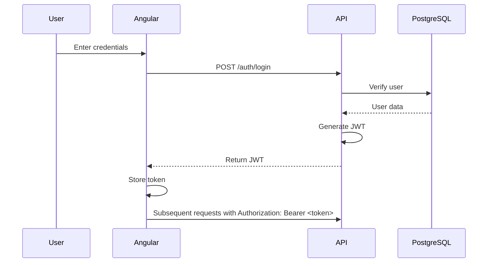

# API Integration Guide

This document describes how the Angular frontend communicates with the NestJS backend API.

## Base Configuration

The API base URL is configured through environment variables:

```typescript
// src/environments/environment.ts (development)
export const environment = {
  production: false,
  apiUrl: 'http://localhost:3000/api'
};

// src/environments/environment.prod.ts (production)
export const environment = {
  production: true,
  apiUrl: process.env['API_URL'] || 'https://your-backend.railway.app/api'
};
```

## Authentication Flow
### JWT Authentication
The application uses JWT (JSON Web Token) for stateless authentication. The flow is as follows:


## HTTP Interceptor
The AuthInterceptor automatically attaches the JWT token to every request:
```typescript
// src/app/core/interceptors/auth.interceptor.ts
@Injectable()
export class AuthInterceptor implements HttpInterceptor {
  intercept(req: HttpRequest<any>, next: HttpHandler): Observable<HttpEvent<any>> {
    const token = localStorage.getItem('access_token');
    
    if (token) {
      req = req.clone({
        setHeaders: {
          Authorization: `Bearer ${token}`
        }
      });
    }
    
    return next.handle(req).pipe(
      catchError(error => {
        if (error.status === 401) {
          // Handle token expiration
          this.authService.refreshToken();
        }
        return throwError(() => error);
      })
    );
  }
}
```

## API Endpoints
### Authentication Module (/auth)
| Method | Endpoint | Description | Auth Required |
| :--- | :--- | :--- | :--- |
| POST | `/auth/login` | User login | No |
| POST | `/auth/register` | User registration | No |
| POST | `/auth/refresh` | Refresh JWT token | Yes |
| POST | `/auth/logout` | User logout | Yes |

### Example Login Request:
```typescript
// src/app/auth/services/auth.service.ts
login(credentials: { email: string; password: string }): Observable<any> {
  return this.http.post(`${this.apiUrl}/auth/login`, credentials).pipe(
    tap((response: any) => {
      localStorage.setItem('access_token', response.access_token);
      localStorage.setItem('refresh_token', response.refresh_token);
    })
  );
}
```

## Users Module (/user)
| Method | Endpoint | Description | Auth Required |
| :--- | :--- | :--- | :--- |
| GET | `/user/profile` | Get current user profile | Yes |
| PUT | `/user/profile` | Update user profile | Yes |
| PUT | `/user/change-password` | Change password | Yes |

## Products Module (/products)
| Method | Endpoint | Description | Auth Required |
| :--- | :--- | :--- | :--- |
| GET | `/products` | Get products list with filters | No |
| GET | `/products/:id` | Get product details | No |
| GET | `/products/new` | Get latest products | No |
| GET | `/products/popular` | Get popular products | No |

### Example Product Service:
```typescript
// src/app/public/services/product.service.ts
@Injectable({ providedIn: 'root' })
export class ProductService {
  private readonly apiUrl = `${environment.apiUrl}/products`;
  
  getProducts(params?: ProductFilters): Observable<PaginatedResponse<Product>> {
    return this.http.get<PaginatedResponse<Product>>(this.apiUrl, { params });
  }
  
  getProductById(id: number): Observable<Product> {
    return this.http.get<Product>(`${this.apiUrl}/${id}`);
  }
  
  getNewProducts(limit: number = 10): Observable<Product[]> {
    return this.http.get<Product[]>(`${this.apiUrl}/new`, { params: { limit } });
  }
}
```

## Cart Module (/cart)
| Method | Endpoint | Description | Auth Required |
| :--- | :--- | :--- | :--- |
| GET | `/cart` | Get user cart | Yes |
| POST | `/cart/items` | Add item to cart | Yes |
| PUT | `/cart/items/:productId` | Update item quantity | Yes |
| DELETE | `/cart/items/:productId` | Remove item from cart | Yes |
| DELETE | `/cart` | Clear cart | Yes |

## Orders Module (/orders)
| Method | Endpoint | Description | Auth Required |
| :--- | :--- | :--- | :--- |
| POST | `/orders` | Create new order | Yes |
| GET | `/orders/user` | Get user orders | Yes |
| GET | `/orders/:id` | Get order details | Yes |
| PUT | `/orders/:id/cancel` | Cancel order | Yes |

## Checkout Module (/checkout)
| Method | Endpoint | Description | Auth Required |
| :--- | :--- | :--- | :--- |
| GET | `/checkout/addresses` | Get saved addresses | Yes |
| POST | `/checkout/addresses` | Add new address | Yes |
| GET | `/checkout/payment-methods` | Get saved payment methods | Yes |
| POST | `/checkout/payment-methods` | Add payment method | Yes |
| POST | `/checkout/orders` | Create order from cart | Yes |

## Data Models
### Product Response DTO
```typescript
interface ProductResponseDto {
  id: number;
  name: string;
  description?: string;
  price: number;
  oldPrice?: number;
  sku?: string;
  imageUrl?: string;
  stockQuantity: number;
  isActive: boolean;
  category?: CategoryResponseDto;
  manufacturer?: ManufacturerResponseDto;
  createdAt: Date;
  updatedAt: Date;
}
```

### Cart Response DTO
```typescript
interface CartResponseDto {
  id: number;
  userId: number;
  total: number;
  itemsCount: number;
  items: CartItemResponseDto[];
  createdAt: Date;
  updatedAt: Date;
}

interface CartItemResponseDto {
  id: number;
  productId: number;
  name: string;
  price: number;
  quantity: number;
  total: number;
  imageUrl?: string;
}
```

### Order Response DTO
```typescript
interface OrderResponseDto {
  uuid: string;
  userId: number;
  status: OrderStatus;
  total: number;
  items: OrderItemDto[];
  shippingAddress: ShippingAddress;
  paymentMethod: PaymentMethod;
  trackingNumber?: string;
  notes?: string;
  createdAt: Date;
  updatedAt: Date;
}
```

## Error Handling
The API returns consistent error responses:
```typescript
interface ErrorResponse {
  statusCode: number;
  message: string | string[];
  error?: string;
  timestamp: string;
  path: string;
}
```

Common HTTP status codes:
| Code | Status | Description |
| :--- | :--- | :--- |
| **200** | OK | Successful request |
| **201** | Created | Resource created |
| **400** | Bad Request | Invalid input |
| **401** | Unauthorized | Missing or invalid token |
| **403** | Forbidden | Insufficient permissions |
| **404** | Not Found | Resource not found |
| **500** | Internal Server Error | Server error |

## Swagger Documentation
Interactive API documentation is available at: http://localhost:3000/swagger (development) or https://your-backend.railway.app/swagger (production).

## Postman Collection
A Postman collection is available at docs/InternetMagazin.postman_collection.json for testing all endpoints.