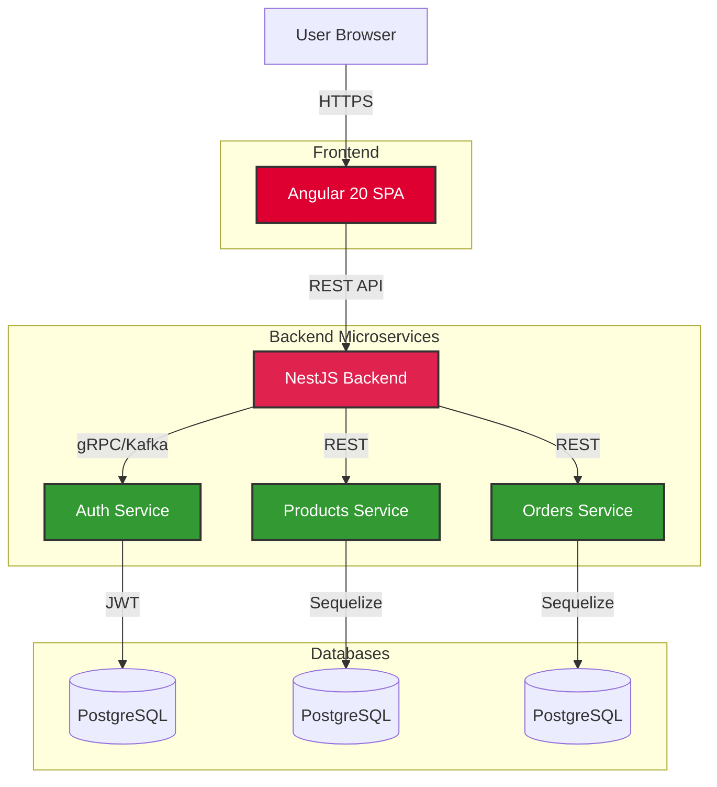

## 🧱 Architecture diagram

```mermaid
graph TD
    User[User Browser] -->|HTTPS| App[Angular 20 SPA]
    App -->|REST API| BFF[NestJS Backend]
    BFF -->|gRPC/Kafka| Auth[Auth Service]
    BFF -->|REST| Products[Products Service]
    BFF -->|REST| Orders[Orders Service]
    Auth -->|JWT| UserDB[(PostgreSQL)]
    Products -->|Sequelize| ProductDB[(PostgreSQL)]
    Orders -->|Sequelize| OrderDB[(PostgreSQL)]

    subgraph Frontend
        App
    end

    subgraph Backend Microservices
        BFF
        Auth
        Products
        Orders
    end

    subgraph Databases
        UserDB
        ProductDB
        OrderDB
    end

    style App fill:#dd0031,stroke:#333,stroke-width:2px,color:#fff
    style BFF fill:#e0234e,stroke:#333,stroke-width:2px,color:#fff
    style Auth fill:#339933,stroke:#333,stroke-width:2px,color:#fff
    style Products fill:#339933,stroke:#333,stroke-width:2px,color:#fff
    style Orders fill:#339933,stroke:#333,stroke-width:2px,color:#fff
```
